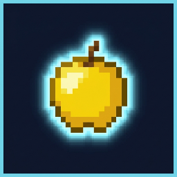
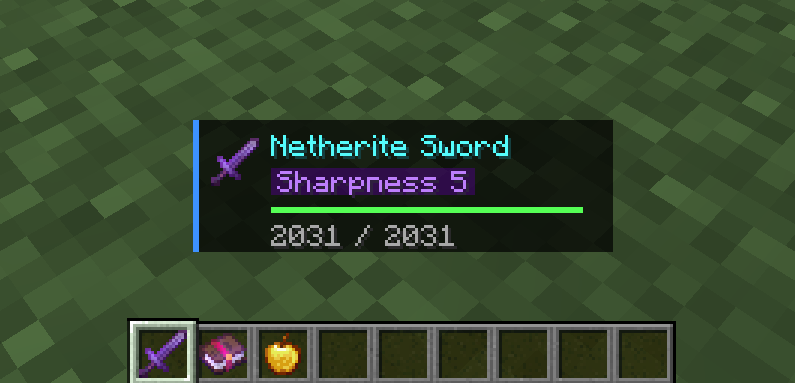
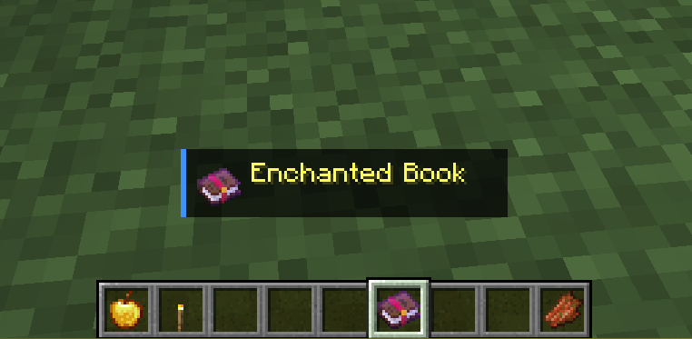
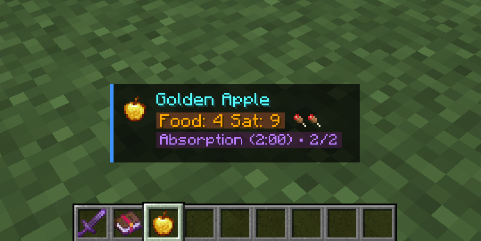
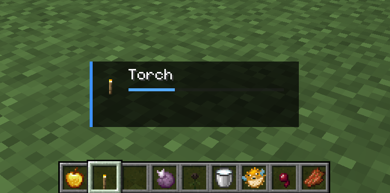

<div align="center">
  
  <h1>✨ Item Glow</h1>
  <p><b>The ultimate, high-fidelity item HUD for Minecraft Fabric.</b></p>

  <p>
    <a href="https://github.com/km5777/ItemGlow/actions"></a>
    <a href="https://github.com/km5777/ItemGlow/releases"></a>
    <a href="https://github.com/km5777/ItemGlow/blob/main/LICENSE"></a>
  </p>

  <p><i>Enhancing your perspective, one item at a time.</i></p>
</div>

---

### 📖 Introduction
**Item Glow** is a premium, client-side modification for Minecraft that redefines how you interact with your inventory. Instead of constantly opening menus to check durability, enchantments, or food stats, Item Glow provides a **sleek, dynamic, and fully customizable HUD** that reveals everything you need to know about the item in your hand.

Built for **Minecraft 1.21.1** on the Fabric loader, it combines cutting-edge performance with a high-end aesthetic.

---

### 🌟 Core Features

<table width="100%">
  <tr>
    <td width="60%">
      <h4>🛡️ Dynamic Combat Intelligence</h4>
      <p>Instantly see the name, durability bar, and precise numerical stats of your gear. No more guessing how many hits your sword has left.</p>
      <ul>
        <li>Real-time durability tracking</li>
        <li>Smooth color-coded health bars</li>
        <li>Customizable numerical display</li>
      </ul>
    </td>
    <td width="40%" align="center">
      
    </td>
  </tr>
  <tr>
    <td width="40%" align="center">
      
    </td>
    <td width="60%">
      <h4>📜 Intelligent Cycling Enchantments</h4>
      <p>Holding a God-tier item? Item Glow smoothly cycles through every enchantment and potion effect, ensuring your screen remains clean while keeping you informed.</p>
      <ul>
        <li>Auto-cycling enchantment lists</li>
        <li>Compact "Pill" style indicators</li>
        <li>Supports complex custom enchantments</li>
      </ul>
    </td>
  </tr>
  <tr>
    <td width="60%">
      <h4>🍎 Nutrition & Status Previews</h4>
      <p>Know exactly what a Golden Apple or a Suspicious Stew will do before you consume it. View hunger restoration, saturation, and hidden potion effects at a glance.</p>
      <ul>
        <li>Icon-based nutrition display</li>
        <li>Saturation & Exhaustion metrics</li>
        <li>Hidden effect reveal</li>
      </ul>
    </td>
    <td width="40%" align="center">
      
    </td>
  </tr>
</table>

---

### 🛠️ Customization & Aesthetics
Item Glow is designed to be your HUD. Using **Cloth Config** and **Mod Menu**, you can customize every pixel:

- **Positioning:** Anchor the HUD to any corner or center it above your hotbar.
- **Glassmorphism:** Adjustable background opacity and blur effects for a premium feel.
- **Animations:** Silky smooth slide-ins and fade-outs that don't distract from gameplay.
- **Toggle Everything:** Don't like the icon? Turn it off. Want only the durability? Done.

---

### 🚀 Opportunities for Developers
Item Glow isn't just a mod; it's a **platform**. I've built a robust API that allows other modders to integrate their custom data directly into the Item Glow HUD.

#### 🔗 Integration API
Are you building a mod with custom mana systems, weapon souls, or unique item states? You can add your own "Elements" to the Item Glow HUD with just a few lines of code.

```java
// Example: Registering a custom Mana Element
ItemGlowApi.registerProvider((stack, player) -> {
    if (stack.getItem() instanceof ManaWand) {
        return new ManaElement(stack.get(MANA_COMPONENT));
    }
    return null;
});
```

#### 💡 Why Integrate?

- **Zero UI Conflict:** Your data is rendered in a consistent, beautiful style.
- **User Preference:** Users can move, scale, and toggle your data alongside the rest of the HUD.
- **Performance:** Leveraging Item Glow's optimized rendering engine means less overhead for your mod.

Check out my [Full API Documentation](https://km5777.github.io/ItemGlow/integration.html) to get started.

---

### 📦 Requirements & Installation
Ensure you have the following installed:
- **[Fabric Loader](https://fabricmc.net/)** (0.15.11+)
- **[Fabric API](https://modrinth.com/mod/fabric-api)**
- **[Cloth Config API](https://modrinth.com/mod/cloth-config)** (Required for Settings)
- **[Mod Menu](https://modrinth.com/mod/modmenu)** (Recommended)

1. Download the latest `.jar` from [Releases](https://github.com/km5777/ItemGlow/releases).
2. Drop it into your `.minecraft/mods` folder.
3. Launch and enjoy!

---

### 🤝 Contributing & Support
If you encounter any issues or have suggestions, please open an [Issue](https://github.com/km5777/ItemGlow/issues) or join the discussion.

<div align="center">
  <a href="https://github.com/km5777/ItemGlow"></a>
  <a href="https://www.paypal.com/donate?token=elNZNapST-z28m88rwdBxMGMxu9C6HetcvJuNdJtdSLSRm9uwXEztr6x9mjz3IVpQAAoOzdnhNLRsZ26&locale.x=US"></a>
</div>

---
<div align="center">
  <sub>Developed with ❤️ by <a href="https://github.com/km5777">K_M577</a></sub>
</div>